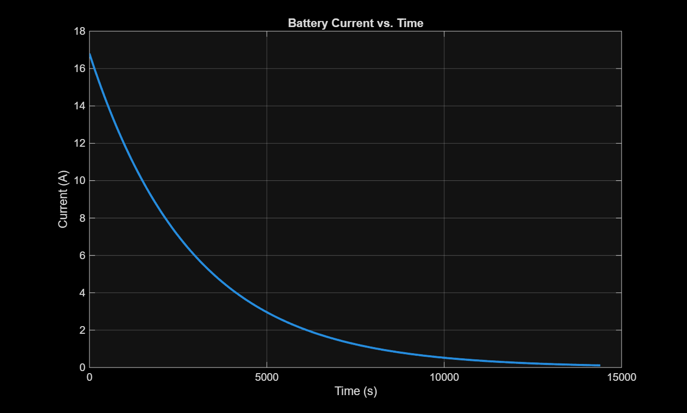
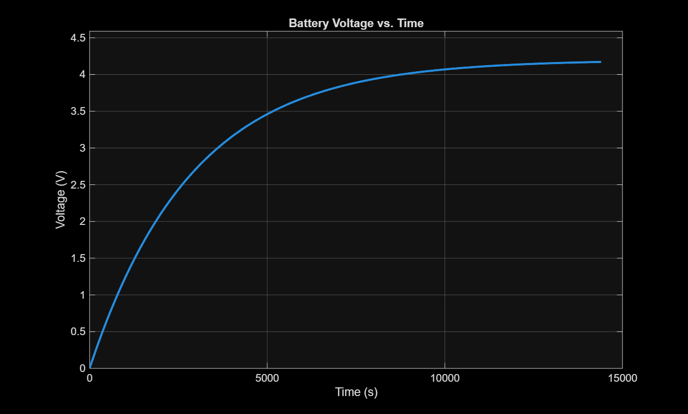
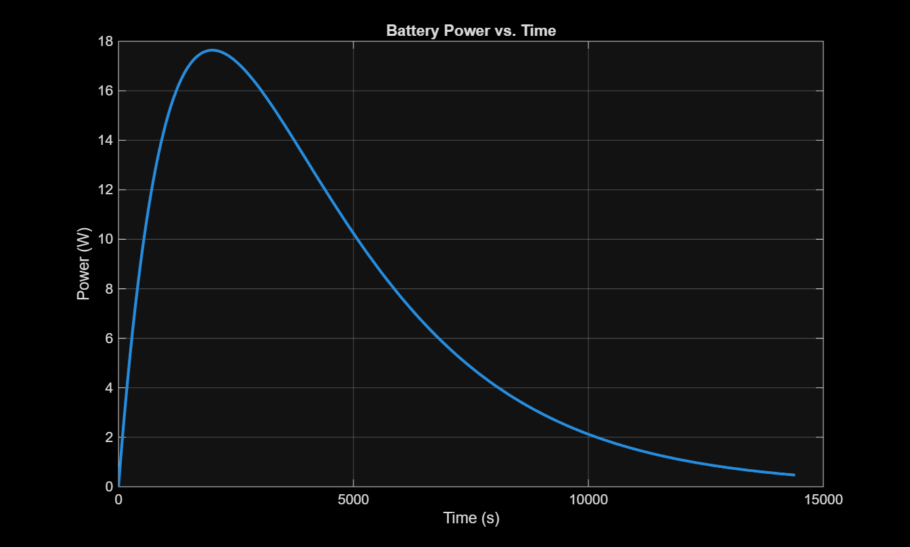
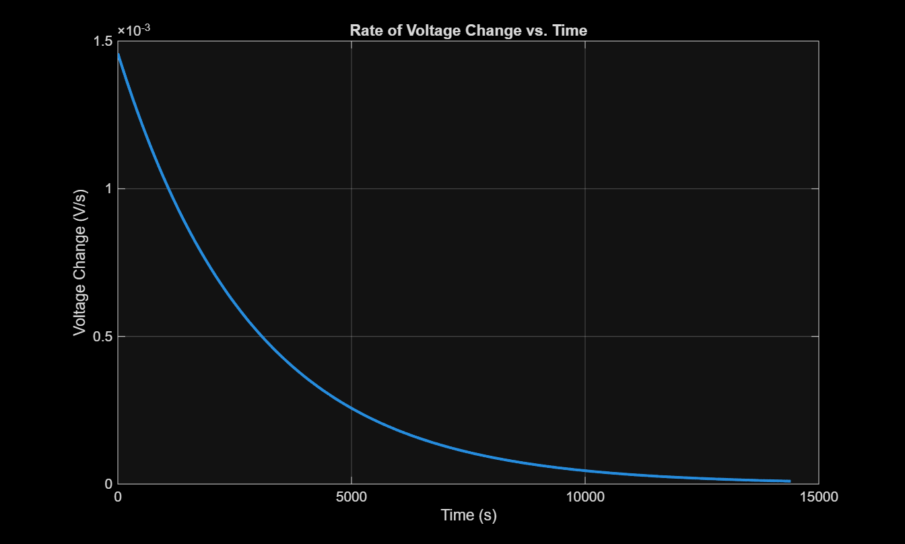
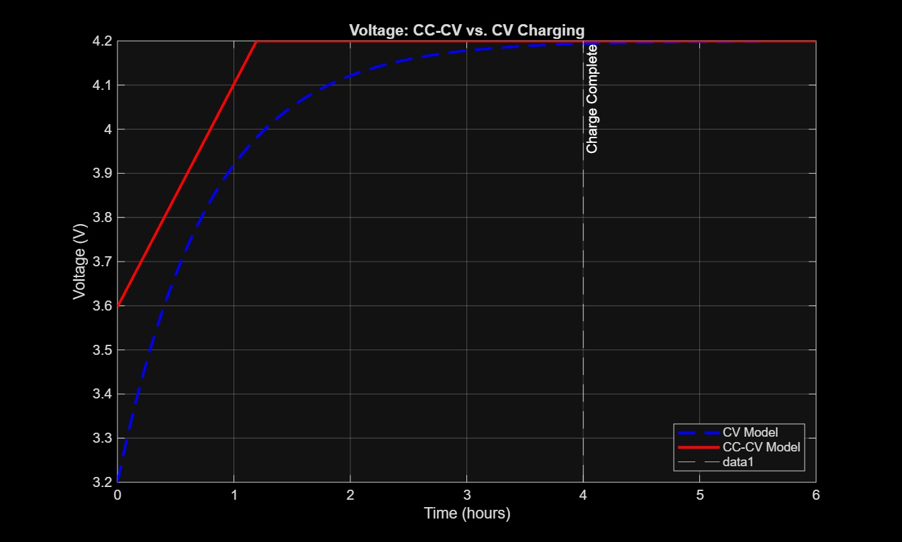
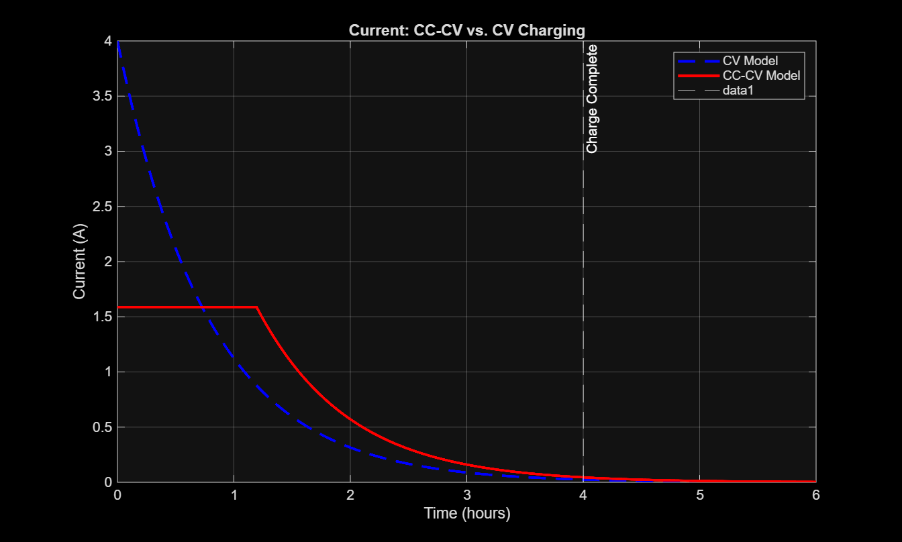

# - Modeling and Optimizing a Battery Charging Profile -
# Project Description

This project models the charging behavior of a Panasonic NCA103450 lithium-ion battery using a first-order RC (resistor-capacitor) circuit approximation. Using MATLAB, we fit a voltage curve based on the battery's specifications, compute the total energy delivered via integration, and analyze key performance metrics like the rate of voltage change, time to charge, and energy lost to heat. The analysis is extended to compare a simple Constant Voltage (CV) charging model with the more common and efficient Constant Current-Constant Voltage (CC-CV) method.

# Methods & Results

The battery is modeled as a capacitor in series with a resistor. The core parameters, internal resistance (R) and equivalent capacitance (C), were derived from the battery's spec sheet, which specifies a 4-hour charge time. Assuming R = 0.25 Ω, the capacitance was calculated to be C = 11338 F to align with a realistic CC-CV charging profile starting from 3.2V.

The model was implemented in MATLAB through a series of modular functions that calculate voltage, current, power, and energy over time. The primary driver scripts, BatteryModel.m and CompareChargingMethods.m, execute the simulation and generate the analysis and plots.

The key results of the comparison show that the CC-CV charging method is significantly faster than a simple CV method. The simulation, which aligns with the manufacturer's data, shows the battery reaching a full charge (defined by a 45mA cut-off current) in approximately 4.02 hours.

# Figures

Voltage and Current Profiles (CV Model)
The following plots show the voltage, current, power, and the rate of voltage change for the simple Constant Voltage (CV) charging model:

CC-CV vs. CV Comparison
These plots compare the voltage and current profiles of the faster CC-CV model against the CV model, highlighting the efficiency gains:

# Repository Layout

    /README.md: This file, providing an overview of the project.

    /main/: Contains the primary MATLAB driver scripts and a subfolder for all functions.

        BatteryModel.m: Main script to run the CV model analysis.

        CompareChargingMethods.m: Main script to run the CC-CV vs. CV comparison.

        /Functions/: Contains all the modular functions used by the main scripts (e.g., ComputeVoltage.m, ComputeCCCV.m).

    /Documents/: Contains project documentation and figures.

        /Plots/: Contains all the .png figures generated by the scripts.

        VoltageModelCalculations.pdf: The detailed derivation of the R and C parameters.

    /archives/: Contains older versions of scripts and files that are no longer in use.

# How to Run the Model

    Ensure all folders and files are in the same MATLAB path. If MATLAB prompts you to "Add to Path," click the button to do so.

    To run the basic CV model analysis, execute main/BatteryModel.m. This will generate three plots and display the energy, efficiency, and charge time calculations in the command window.

    To run the comparison between charging methods, execute main/CompareChargingMethods.m. This will generate two plots comparing the voltage and current profiles and print the final charge time for the CC-CV method.

# Work Breakdown

    Yeidi Bautista: Set up a team organization tool to manage all tasks. Sourced battery and specification sheets for said NCA103450 battery. Calculated R & C values based on spec sheet charging times. Drafted initial script for battery voltage plot. Wrote and implemented functions for calculating the time to reach 80% and 100% SOC. Drafted and finalized functions and script to compare our original RC model to a CC-CV charging method.

    Mariah Contreras: Rewrote drafts to implement modular functions. Finalized main battery script to calculate and plot battery current vs.time, voltage vs. time, and power vs. time. Calculated the derivative in order to plot the rate of voltage change. Documented calculations in a more reader-friendly TEX format. Organized team documents into a shared google drive folder.

    Baltazar Pacheco Hernandez: Ran through files to ensure there were no issues and debugged them if needed. Cleaned up files to improve readability and made adjustments to comments/code in the files. Calculated the Charging Efficiency based on an RC Circuit using the provided R & C values. Wrote functions to find the optimized charging time and worked with the optimization toolbox, and attempted to implement it.

    Hassan Naboulsi: Updating GitHub README file with recent code changes and usage instructions. Managed meeting agendas. Conducted routine repository quality checks. Reviewed and summarized basic RC-circuit theory. Researched optimization toolbox.

# Further Notes

